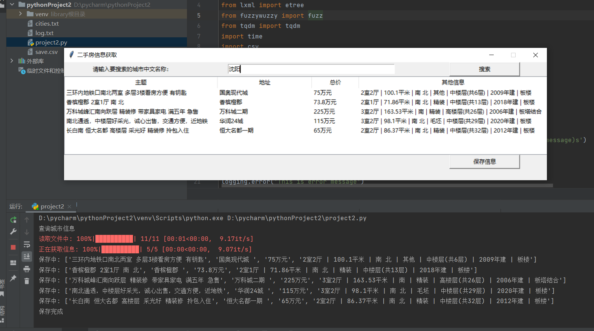

# python_project2
## 1 Mission Description
Design a Python program to implement the following:
1) Use object-oriented thinking to design and reuse the functional functions in Project1 (log, progress bar);
2) Develop a GUI based on tkinter, enter the name of the provincial capital city, and display the city’s second-hand housing information;
3) Obtain second-hand housing information in provincial capital cities (location/unit type/area/orientation/decoration/floor/age/structure/price, etc.), pay attention to the frequency of access, and do not need to load them all (can be crawled on the Lianjia website, or other methods also may);
4) House information is stored in the database
## 2 Data structure design
Use the dictionary data structure in Python to convert the txt file that stores city names and pinyin initials into a dic dictionary. The key is the Chinese name of the city, and the value is the first letter of the pinyin of the city to achieve subsequent additions, deletions, modifications, and fuzzy matching.
For example: {'Beijing': 'BJ', 'Shanghai': 'SH', 'Shenyang': 'SY'}
## 3 Algorithm design
### 3.1 Read the txt file and convert it into a dictionary to read the first letter corresponding to the Chinese name of the city: (reproduce project1) 
~~~
fr = open('cities.txt', 'r')

dic = {}
keys = []  # 用来存储读取的顺序
for line in fr:
    if line.isspace():
        continue
    else:
        v = line.strip().split(':')
        dic[v[0]] = v[1]
        keys.append(v[0])
print(dic)
~~~
### 3.2 Fuzzy matching (using fuzzywuzzy): (reproduce project1)
~~~
from fuzzywuzzy import fuzz
def fuzz_matching(allofkey, keycheck, model):
    if (model == '1'):
        score = fuzz.ratio(allofkey, keycheck)
        return score
    if (model == '2'):
        score = fuzz.token_sort_ratio(allofkey, keycheck)
        return score

scoretemp = 0

for allofkey in tqdm(dic.keys(), desc='读取文件中'):
    time.sleep(0.1)
    score = fuzz_matching(allofkey, args.keycheck, args.model)
    if (score > scoretemp):
        scoretemp = score

keycheck = args.keycheck
model = args.model

for allofkey in dic.keys():
    if (fuzz_matching(allofkey, keycheck, model) == scoretemp):
        if (scoretemp == 100):
            print('该城市名称的首字母是：', dic.get(allofkey))
        else:
            print('查无此城，与之最相近的城市名称是：', allofkey, dic.get(allofkey))
~~~

### 3.3 Progress bar and log (reproduce project1)
~~~
from tqdm import tqdm

for allofkey in tqdm(dic.keys(), desc='读取文件中'):

import logging

logging.basicConfig(filename='log.txt', level=logging.INFO,
                    format='%(asctime)s %(filename)s[line:%(lineno)d] %(levelname)s %(message)s')
logging.debug('This is debug message')
logging.info('This is info message')
logging.warning('This is warning message')
logging.error('This is error message')
logging.critical('This is critical message')#生成log文件
~~~

### 3.4 Crawl website information
~~~
import requests
def show():#爬虫函数
    for child in tree.get_children():
        tree.delete(child)#初始化treeview

    city_temp = entry1.get()
    city = select(city_temp)#从输入框中读取城市名称并进行模糊匹配

    url = 'https://' + city + '.lianjia.com/ershoufang/'#将城市名称带入到url
    headers = {'User-Agent': 'Mozilla/5.0 (Windows NT 10.0; WOW64) AppleWebKit/537.36 (KHTML, like Gecko) Chrome/84.0.4147.89 Safari/537.36 SLBrowser/7.0.0.12151 SLBChan/30'}#伪装成正常用户
    response = requests.get(url=url, headers=headers)#向网页请求
    html_data = response.text#获取网页前端代码

    html = etree.HTML(html_data)#网页前端代码解析
    for i in tqdm(range(1, 6), desc='正在获取信息'):#获取相应的文本信息
        i = str(i)
        title = html.xpath('/html/body/div[4]/div[1]/ul/li[' + i + ']/div[1]/div[1]/a/text()')[0]#获取标题
        address = html.xpath('/html/body/div[4]/div[1]/ul/li[' + i + ']/div[1]/div[2]/div/a[1]/text()')[0]#获取地址
        totalprice = html.xpath('/html/body/div[4]/div[1]/ul/li[' + i + ']/div[1]/div[6]/div[1]/span/text()')[0] + '万元'#获取总价
        info = html.xpath('/html/body/div[4]/div[1]/ul/li[' + i + ']/div[1]/div[3]/div/text()')[0]#获取其他信息

~~~
### 3.5 GUI design
~~~
import tkinter as tk
from tkinter import ttk
window = tk.Tk()#主窗口

window.title("二手房信息获取")#窗口标题

window.geometry("1025x250")#窗口尺寸

window.resizable(width=False, height=False)

label1 = tk.Label(text='请输入要搜索的城市中文名称：').grid(column=0, row=0)#标签1

entry1 = tk.Entry(width=50)#输入框
entry1.grid(column=1, row=0)
button1 = tk.Button(text='搜索',width=20, command=show).grid(column=2, row=0)#搜索按钮

tree = ttk.Treeview(window, columns=('c1', 'c2', 'c3', 'c4'), show='headings', height=7)
tree.grid(columnspan=3, rowspan=5)
tree.heading('c1', text='主题')
tree.column('c1', width=325)
tree.heading('c2', text='地址')
tree.column('c2', width=200)
tree.heading('c3', text='总价')
tree.column('c3', width=100)
tree.heading('c4', text='其他信息')#treeview设置
tree.column('c4', width=400)

button2 = tk.Button(text='保存信息', width=20, command=save).grid(column=2, row=6)#保存按钮

window.mainloop()#显示窗口
~~~

### 3.6 Save the obtained information to a csv file
~~~
import csv
#以gbk编码的方式将爬虫获取的文件保存在csv中，更方便以excel形式打开csv

def save():
    with open("save.csv","a", newline='', encoding='gbk') as file:
        csvwriter = csv.writer(file)

        for row_id in tree.get_children():
            row = tree.item(row_id)['values']
            csvwriter.writerow(row)
            print('保存中:', row)
            time.sleep(0.1)
        print("保存完成")
~~~

## 4 Result graph

